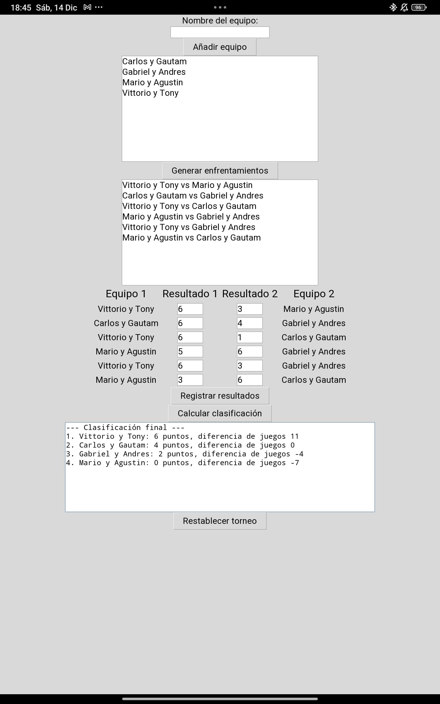

# 🎾 Torneo de Pádel - Generador y Clasificador

Este es un programa desarrollado en **Python** utilizando **Tkinter** para organizar un torneo de pádel con 4 equipos. El software permite registrar equipos, generar partidos automáticamente, introducir resultados y calcular una clasificación con criterios de desempate.

---

## 🎓 Características principales

- **Registro de Equipos**: Permite añadir hasta 4 equipos.
- **Generación Automática de Partidos**: Los partidos se generan aleatoriamente y aseguran que cada equipo juegue contra todos los demás.
- **Registro de Resultados**: Se introducen los resultados de cada partido.
- **Clasificación Automática**:
   - Calcula la clasificación en función de puntos y diferencia de juegos.
   - Aplica **criterio de desempate** por enfrentamiento directo si dos equipos tienen los mismos puntos y diferencia de juegos.
- **Restablecer Torneo**: Reinicia el torneo para una nueva competición.

---

## 🛠️ Instalación

Asegúrate de tener **Python** instalado en tu equipo. Luego sigue estos pasos:

1. **Clona este repositorio**:
   ```bash
   git clone https://github.com/tonyvillegas91/torneo-padel.git
   cd torneo-padel
   ```
2. **Ejecuta el programa**:
   ```bash
   python torneo_padel.py
   ```

---

## 📈 Uso del programa

1. **Añadir Equipos**:
   - Introduce el nombre de los equipos en el campo de texto.
   - Haz clic en **"Añadir equipo"** para registrarlos.

2. **Generar Enfrentamientos**:
   - Una vez que los 4 equipos estén registrados, haz clic en **"Generar enfrentamientos"**.
   - Se mostrará una lista con todos los partidos generados.

3. **Introducir Resultados**:
   - Rellena los campos de resultados con los juegos ganados por cada equipo.
   - Haz clic en **"Registrar resultados"**.

4. **Calcular Clasificación**:
   - Haz clic en **"Calcular clasificación"** para ver la tabla final ordenada por puntos y diferencia de juegos.
   - En caso de empate, el sistema prioriza al **ganador del enfrentamiento directo**.

5. **Restablecer Torneo**:
   - Para reiniciar todo, haz clic en **"Restablecer torneo"**.

---

## 🎨 Captura de pantalla



---

## 🔧 Tecnologías utilizadas

- **Python** - Lógica y procesamiento.
- **Tkinter** - Interfaz gráfica para el usuario (GUI).

---

## ⚖️ Criterios de clasificación

1. **Puntos**:
   - **2 puntos** para el ganador del partido.
   - **1 punto** en caso de empate.
   - **0 puntos** en caso de derrota.
2. **Diferencia de Juegos**: Se calcula restando los juegos perdidos de los ganados.
3. **Enfrentamiento Directo**: Si dos equipos tienen el mismo puntaje y diferencia de juegos, el sistema prioriza al ganador del partido entre ellos.

---

## 💡 Observaciones
- Este programa es ideal para torneos rápidos con 4 equipos.
- Puedes adaptarlo para soportar más equipos modificando la lógica de generación de partidos.

---

## 🚀 Futuras mejoras
- Soporte para más de 4 equipos.
- Exportación de resultados a un archivo **CSV** o **PDF**.
- Generación de gráficos con la evolución de los resultados.

---

## ❤️ Agradecimientos

Gracias por usar este programa. Si te resulta útil, no dudes en darle una estrella al repositorio.

---

## 📤 Contribuciones

Si deseas contribuir:
1. Realiza un **fork** del repositorio.
2. Crea una rama para tus cambios:
   ```bash
   git checkout -b nueva-funcionalidad
   ```
3. Envía un **pull request**.

---

## 📚 Licencia

Este proyecto está bajo la licencia **MIT**. Puedes consultar los términos [aquí](LICENSE).

---

## 📏 Contacto

- **Autor**: Tony Villegas Brea
- **Correo**: tony.villegas91@gmail.com
- **GitHub**: [tonyvillegas91](https://github.com/tonyvillegas91)

---

_Disfruta organizando tu torneo de pádel sin complicaciones._ 🎾🏰🌟
